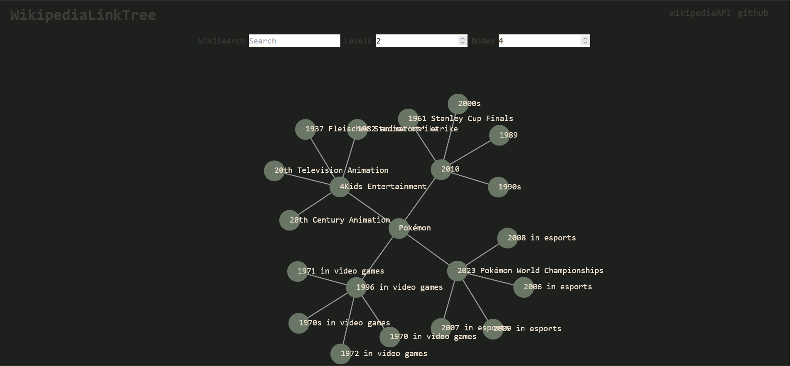

# WikiLinkTree

A React-based project that visualizes Wikipedia articles in a dynamic, interactive tree structure using the Wikipedia API and D3.js. This project leverages a force-directed graph layout to represent links between articles, allowing users to explore related topics visually.

## Demo

*Screenshot showing the force-directed tree visualization of Wikipedia article on Pokémon.*

## Features

- **Dynamic Article Search**: Fetches Wikipedia articles based on user input.
- **Tree Structure**: Displays linked articles as nodes in a force-directed graph.
- **Interactive Graph**: Nodes can be dragged, clicked.

## Technologies Used

- **Vite**: For vite devtools 
- **React**: For building the interactive UI components.
- **Wikipedia API**: For fetching article data and related links.
- **D3.js**: For rendering the force-directed graph that displays articles and their links.
- **Tailwind**: For styling the app.

## Installation

1. **Clone the repository:**
   ```bash
   git clone https://github.com/robinsrarf/WikiLinkTree.git
   cd WikiLinkTree
2. **Install the dependencies:**
   ```bash
   npm install
3. **Start the development server:**

   ```bash
   npm run dev